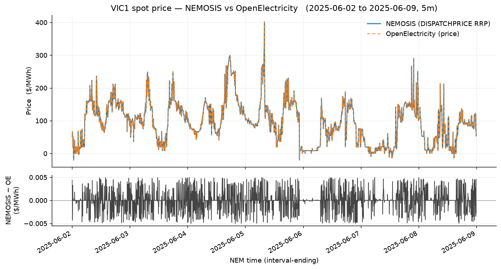

# nem-battery-sim

**Degradation-aware BESS dispatch simulator on real NEM data**

## Thesis

A grid battery in Australia's National Electricity Market (NEM) earns money by
charging when power is cheap and discharging when it's dear (energy arbitrage),
and by holding capacity for frequency services (FCAS). But battery degrades over
time and aggresive operating condition can accelerate the degradation of battery 
and reduce the lifetime of the battery. This project simulates optimal battery 
dispatch against **real NEM price data**, and takes into account of the cost of 
degradation by incorporating different battery degradation models.


## Dependencies — and why each one is here

| Package | Why it's in this project |
|---|---|
| [`nemosis`](https://github.com/UNSW-CEEM/NEMOSIS) | Primary data source — pulls historical AEMO NEMweb tables (dispatch & FCAS prices, demand) into tidy DataFrames. |
| [`openelectricity`](https://github.com/opennem/openelectricity-python) | Second, independent price source (OpenElectricity/OpenNEM API) — used to cross-check NEMOSIS pulls and grab recent data. Needs a free API key. |
| [`linopy`](https://linopy.readthedocs.io) | Builds the dispatch optimisation model (the arbitrage/FCAS LP-MILP) in a pandas/xarray-native way. |
| [`highspy`](https://highs.dev) | The HiGHS solver — the open-source LP/MILP engine that actually solves the linopy model. |
| [`pandas`](https://pandas.pydata.org) | Wrangling the price time series and dispatch/revenue results. |
| [`matplotlib`](https://matplotlib.org) | Plots — price series, dispatch schedules, and the naive-vs-degradation revenue comparison for the write-up. |

Data layer → `nemosis` + `openelectricity` + `pandas`; optimiser → `linopy` +
`highspy`; visualisation → `matplotlib`.

## Getting started

```bash
uv sync                       # create the environment from uv.lock
cp .env.example .env          # then paste your OpenElectricity key into .env
uv run python -c "import nemosis, openelectricity, linopy, highspy"   # smoke test
```


## First data pull — NEMOSIS vs OpenElectricity



*VIC1 5-minute spot price, 2–9 June 2025: NEMOSIS `DISPATCHPRICE` RRP overlaid with the
OpenElectricity price series (top), and the source-to-source difference in `$/MWh` (bottom).*

Pull, cross-check, and the read on whether the two sources agree:
[`notebooks/01_smoke_test_price_sources.ipynb`](notebooks/01_smoke_test_price_sources.ipynb).

## Status

Phase 0 — scaffolding. Build plan (data layer → arbitrage LP → FCAS
co-optimisation → degradation module → imperfect foresight → write-up) lives in
the learning curriculum; this repo is the keystone artifact for it.
